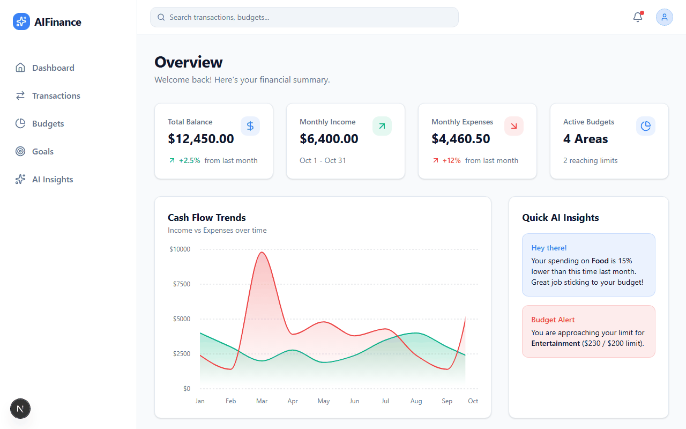

# WealthPulse

A personal finance dashboard: transactions, budgets, savings goals, and a chat assistant, built with Next.js 16 (App Router), TypeScript, and Tailwind.

Live: https://ai-finance-dashboard-g6sj6rihi-bhanus-projects-5e569201.vercel.app

## Demo

The real dashboard, and the real fix in action — asking the chat "Am I over budget on anything?" returns a computed answer (`You're over budget on: Entertainment by $30.00.`) that matches the actual budget data exactly, not a canned string:



## What's actually here

This repo previously had no real README (just the unedited `create-next-app` boilerplate), despite there being a genuinely built app underneath — real dashboard pages (`transactions`, `budgets`, `insights`), a component-based architecture (`SummaryCards`, `TransactionsTable`, `TrendChart`, `ChatAssistant`), auth pages, and an API route. Documented here for what it actually is:

- **`src/app/dashboard/*`**: overview, transactions, budgets, and insights pages.
- **`src/components/`**: presentational components (summary cards, transaction table, trend chart, chat UI, app shell/nav).
- **`src/data/mockData.ts`**: the data layer — transactions, budgets, goals — currently mock data, not a live backend/database.
- **`src/app/api/ai/route.ts`**: the chat backend.

## A real fix: the "AI" chat wasn't AI

The chat route previously returned hardcoded strings matched by a handful of `.includes()` keyword checks, with a `setTimeout` to simulate API latency and a comment reading "in a real application you would pass this to OpenAI/Claude API." It didn't call anything, and the replies didn't reflect the real transaction/budget data.

Fixed in `src/lib/analytics.ts`: real functions (`categorySpend`, `totalExpenses`, `totalIncome`, `budgetOverages`, `highestExpenseCategory`) that compute actual results from `mockTransactions`/`mockBudgets` each time they're called, plus `answerQuestion()`, which routes a free-text question to the right computation and formats the real number into a reply. This is **rule-based analytics, not an LLM** — deliberately labeled as such rather than implying more than it is. `route.ts` now calls this instead of returning canned strings.

## Verified

```bash
npm install
npx tsc --noEmit     # clean, no type errors
npm run build        # production build succeeds, all routes compile
```

## Tech Stack

Next.js 16 (App Router, Turbopack), React, TypeScript, Tailwind CSS, Recharts (trend chart), lucide-react (icons).

## Getting Started

```bash
npm install
npm run dev
```

Open [http://localhost:3000](http://localhost:3000).
